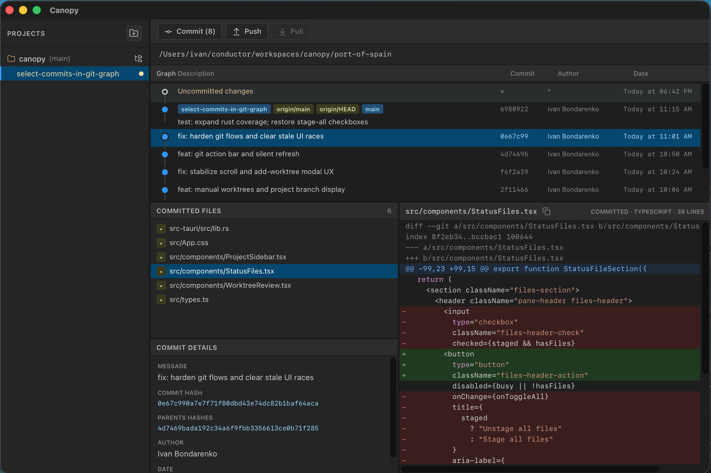

# Canopy

Open-source Git client built for worktrees. Browse repos, switch worktrees, and review changes without juggling multiple windows.

Stack: **Tauri 2** + **React** + **TypeScript**. Tooling via **mise**.



## Prerequisites

- [mise](https://mise.jdx.dev/) (Node and Rust)
- macOS: Xcode Command Line Tools

```bash
mise install
```

## Develop

```bash
npm install
npm run tauri:dev
```

## Build

```bash
npm run tauri:build
```
